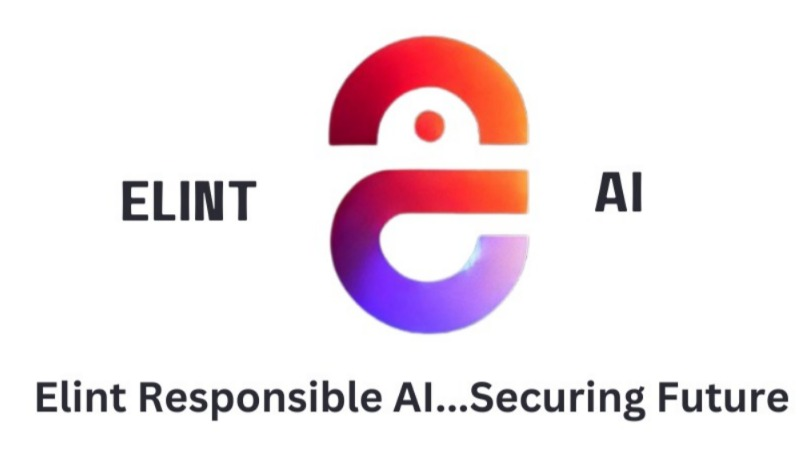
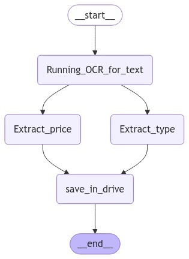
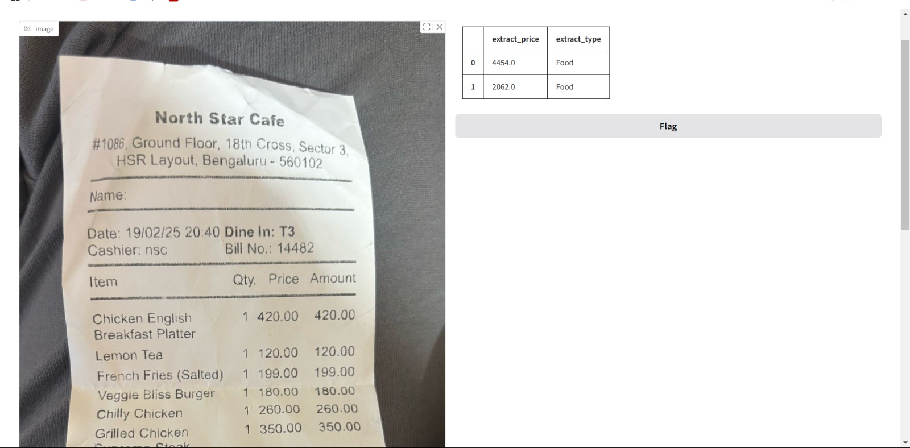

[ELINT AI](http://elintdata.ai/)
# Reimburse OCR AI Agent

Reimburse OCR agent is a tool designed to automate the process of extracting and processing reimbursement data from receipts and invoices using OCR and AI Agents.

This is a community-maintained version.

## Getting started

To get started with Reimburse OCR, follow these steps:

1. Clone the repository to your local machine.
2. Install the required dependencies.
3. Run the application.

## Working
1) OCR scans your Reciept.
2) LLM summarizes your text.
3) LLM extracts the grand total price and bill type. 
4) Bill type and price adds to your file in drive.

## Add your files

Upload your receipt or invoice files to the designated folder for processing.
or
Run an gradio instance by iced_main.py and upload your reciepts there

## Integrate with your tools

Reimburse tool can be integrated with various tools and services to streamline your workflow. Refer to the integration guide for more details.

## Collaborate with your team

Share access with your team members to collaborate on processing and reviewing reimbursement data.

## Name

Reimburse OCR AI Agent

## Description

A tool for automating the extraction and processing of reimbursement data using OCR technology and AI Agents.

## Visuals

## Installation

1) Install requirements.txt
2) Run iced_main.py to run an gradio instance.
3) Use the link to use the software

## Usage

Run a Gradio instance by using iced_main.py and upload your documents on the generated link.

## Support

For support, contact query@elintdata.ai.

## Roadmap

Best UI for such utility should be Whatsapp integration.
Any Whatsapp API guru are most welcome. 
Contact us at sumit.jha@elintdata.ai

## Contributing

Provide guidelines for contributing to the project, including how to submit issues and pull requests.

## Authors and acknowledgment

* Chirag Vashistha ( Chirag.V@ElintData.ai ) 

* Sumit Jha ( Sumit.Jha@ElintData.ai )

## License

Elint AI

## Project status

This project is a community-driven initiative, actively developed and maintained by a passionate group of contributors. We welcome your involvement and encourage you to submit pull requests to enhance its functionality.

